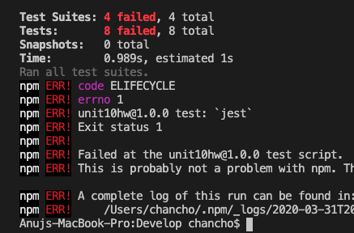
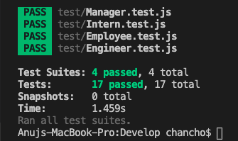

<br>

# Password Creator
### CLI is hell.
---
<br>

## Setting up Environment

Right off the bat, I had to set up the file structure as required in the README.  

While in terminal, I ran "npm init" to generate a new package.json file in this directory.
```
npm init
```
Next, I installed "jest" with "npm i -D jest" to bring it in as a dependency.
```
npm i -D jest
```
Last, I went into the package.json file and changed the value of test from that long string to simply read "jest".  
```
"test": "jest"
```
Our environment is now test-ready!

<br>

---
<br>

## Running Tests
#### Main Class Constructor

This was a tough concept for me to grasp.  CLI-based development has such minimal visibility into its processes that its very difficult to grasp what is actually happening behind the scenes.

When the js files are empty, running "npm test" returns the following error.  Considering that there are 17 tests total, I immediately noticed that only 8 are running.  I believe those 8 are the only ones hinging on "module.exports".



<br>

The Employee.test.js file told me in the test strings that we have a constructor with three parameters. 
```
function newEmployee (name, id, title) {
    this.name = name,
    this.id = id,
    this.title = title
}
```

Going back to the README, I saw that we are actually creating employees with 1 of 3 subclasses: Engineer, Manager or Intern.  

Rather than a regular constructor, this means that we need to utilize use a class constructor and extend that class for the 3 subclasses.
```
class Employee {
    constructor (name, id, email) {
        this.name = name;
        this.id = id;
        this.email = email;
    }
}
```

With my constructor built, I went on to write my 4 functions. They are very basic in syntax and return each of the 3 parameters called out in my constructor.
```
// getName()
Employee.prototype.getName = function () {
    // console.log(this.name);
    return this.name;
}

// getId()
Employee.prototype.getId = function () {
    return this.id;
}

// getEmail()
Employee.prototype.getEmail = function () {
    return this.email;
}

// getRole() // Returns 'Employee' 
Employee.prototype.getRole = function () {
    return "Employee";
}
```
I created an employee using my constructor and passed that employee through my 4 functions.  Lastly, I initialized the Employee.js file to be read by its test.js counterpart with "module.exports".
```
var crazyAlice = new Employee("Alice", 100, "test@test.com");

crazyAlice.getName();
crazyAlice.getId();
crazyAlice.getEmail();
crazyAlice.getRole();

module.exports = Employee;
```

<br>

#### Subclass Constructors

In each of the other js files, we are pulling in the Employee.js file that was just primed for export.
```
const Employee = require("../lib/Employee");
```

Next, we write a subclass constructor that builds on the Employee constructor.  In this case, we have our Engineer.  The Engineer has all of the parameters that the Employee, as well as the added parameter of github.
```
class Engineer extends Employee {
    constructor(name, id, email, github) {  
      super(name, id, email);
      this.github = github;
    }
}
```

The same way we wrote a few functions for our Employee, we do the same for the Engineer. 
```
// getGithub()
Engineer.prototype.getGithub = function () {
    return this.github;
}

// getRole() // Overridden to return 'Engineer'
Engineer.prototype.getRole = function () {
    return "Engineer";
}
```
Here, I created a new engineer using my subclass constructor and went on to pass that variable through my functions.  Like before, we also export this file, so it may be read by the test.js file.
```
var newEngi = new Engineer("Gimli", 1, "test@test.com", "GitHubUser");

newEngi.getGithub();
newEngi.getRole();

module.exports = Engineer;
```

I repeated this process with the final 2 js files and eventually got 100% success when running "npm test" in terminal.


